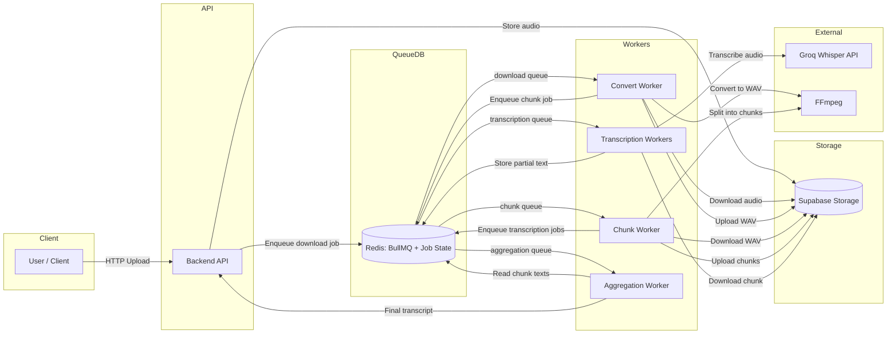

# Multistage Transcription Pipeline
Queue-driven audio transcription system that uploads audio, converts and chunks it, runs speech-to-text, and aggregates the final transcript.

**Overview**
This project solves the challenge of reliably transcribing long audio files by breaking them into manageable chunks and processing them with a distributed worker pipeline.

Key features:
- Multipart upload API that accepts audio files and enqueues jobs
- Multi-stage pipeline: download and convert, chunk, transcribe, aggregate
- Redis-backed queues with BullMQ for reliability and retries
- Supabase Storage integration for audio assets
- Groq Whisper-based transcription for each chunk
- Overlap-aware text merging to reduce repeated words

**Architecture Overview**
At a high level, a client uploads audio to the backend API, which stores the file in Supabase and enqueues a job in Redis. Workers pull jobs from queues and process the audio in stages, storing intermediate results back to Supabase and Redis. The final transcript is assembled in the aggregation stage.

Data flow step-by-step:
1. Client uploads an audio file to `POST /transcribe`.
2. Backend stores the raw file in Supabase Storage and enqueues a `download` job.
3. Convert worker downloads the file, converts it to WAV, uploads it, and enqueues a `chunk` job.
4. Chunk worker downloads the WAV, splits it into overlapping chunks, uploads chunks, and enqueues `transcription` jobs.
5. Transcription workers fetch each chunk, call Groq Whisper, and store chunk text in Redis.
6. Aggregation worker reads all chunk texts from Redis, merges overlaps, and produces the final transcript.

**Architecture Diagram**


**Component Breakdown**
Frontend:
- Not included in this repo. Any client can call the backend API to submit audio files.

Backend:
- `backend/` handles uploads and enqueues the initial job.
- `convert-worker/`, `chunk-worker/`, `transcription-workers/`, and `aggregation-worker/` process jobs in sequence.

Database:
- Redis stores queues and short-lived job state.
- Supabase Storage stores raw audio, WAV files, and chunks.

Third-party integrations:
- Groq Whisper API for speech-to-text.
- FFmpeg for audio conversion and chunking.

**Tech Stack**
- Node.js (CommonJS)
- Express
- BullMQ + Redis
- Supabase Storage (`@supabase/supabase-js`)
- Groq SDK (`groq-sdk`)
- FFmpeg (`fluent-ffmpeg`)
- Multer (multipart uploads)
- Axios

**Installation**
Prerequisites:
- Node.js 18+ (or a recent LTS)
- Redis instance reachable by all services
- FFmpeg installed and available on `PATH`
- Supabase project + storage bucket
- Groq API key (for transcription workers)

Steps:
1. Install dependencies for each service.
```bash
cd backend && npm install
cd ../convert-worker && npm install
cd ../chunk-worker && npm install
cd ../transcription-workers && npm install
cd ../aggregation-worker && npm install
```
2. Create environment files.
Create `backend/.env` (based on `backend/.env.example`).
Create `convert-worker/.env` (based on `convert-worker/.env.example`).
Create `chunk-worker/.env`.
Create `transcription-workers/.env`.
Create `aggregation-worker/.env`.
3. Ensure Redis and Supabase are configured and reachable.

**Usage**
Run each service in its own terminal:
```bash
cd backend && npm run dev
cd ../convert-worker && npm run dev
cd ../chunk-worker && npm run dev
cd ../transcription-workers && npm run dev
cd ../aggregation-worker && npm run dev
```

Example API call (multipart upload):
```bash
curl -X POST http://localhost:<PORT>/transcribe \
  -F "file=@/path/to/audio.mp3"
```

**Project Structure**
- `backend/` REST API for uploads and job creation
- `convert-worker/` converts uploaded audio to WAV and enqueues chunking
- `chunk-worker/` splits WAV into overlapping chunks and enqueues transcription
- `transcription-workers/` transcribes each chunk via Groq and stores results in Redis
- `aggregation-worker/` merges chunk texts into final transcript
- `storage/` placeholder for local assets (currently empty)

**Environment Variables**
Common (all services):
- `REDIS_HOST` Redis host
- `REDIS_PORT` Redis port
- `REDIS_USERNAME` Redis username
- `REDIS_PASSWORD` Redis password
- `PORT` Service HTTP port (defaults to `80` if not set)

Supabase (backend, convert-worker, chunk-worker, transcription-workers):
- `SUPABASE_API_KEY` Supabase service key
- `SUPABASE_PROJECT_URL` Supabase project URL
- `SUPABASE_BUCKET` Storage bucket name
- `SUPABASE_FOLDER` Folder prefix for stored files

Transcription workers only:
- `GROQ_API_KEY` Groq API key used by `groq-sdk`

**API Endpoints**
Backend service:
- `GET /` Health info and service metadata
- `GET /health` Simple health check
- `POST /transcribe` Upload an audio file and enqueue the transcription pipeline

Worker services (convert, chunk, transcription, aggregation):
- `GET /` Health info and service metadata
- `GET /health` Simple health check

**Future Improvements**
- Persist final transcripts to Supabase/Postgres
- Add job status endpoint (`/jobs/:id`)
- Add authentication and rate limiting
- Centralized logging and metrics

**Contributing**
1. Fork the repo and create a feature branch.
2. Keep changes focused and add tests where appropriate.
3. Open a PR with a clear description of your changes.

**License**
ISC
