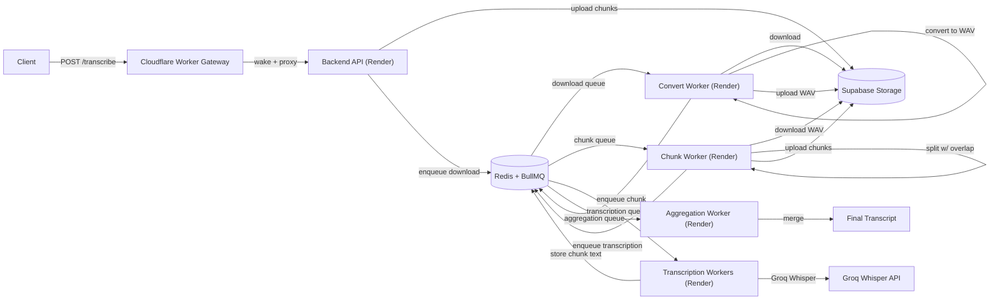

# AudioFlow: Distributed Transcription System (Commodity Services)

## Overview

This project is a scalable, multi-stage **audio** transcription pipeline built to handle large files within free-tier limits. It breaks big uploads into smaller chunks, processes them asynchronously across worker services, and merges results into a final transcript. It also mitigates cold starts by routing requests through a Cloudflare Worker that wakes Render services before jobs begin.

The core problem solved: most speech-to-text APIs and storage providers cap request sizes. This pipeline reliably transcribes long recordings by staging, chunking, and coordinating work across small, commodity hardware.

## Features

- Large-file ingestion with asynchronous job handling
- Size-based pre-chunking to respect Supabase (storage) and Groq Whisper (request) limits
- Audio normalization (mono, 16kHz WAV) before fine-grained chunking
- Overlap-aware chunking for better transcript continuity
- Redis + BullMQ queues with retries and backoff
- Cloudflare Worker gateway to wake sleeping Render services
- Supabase Storage integration for intermediate artifacts

## Architecture Explanation

1. **File upload**: Client sends `POST /transcribe` to the Cloudflare gateway or directly to the backend.
2. **Initial chunking**: Backend splits the raw audio into size-safe chunks (based on `SUPABASE_MAX_MB` and `WHISPER_MAX_MB`).
3. **Storage**: Each chunk is uploaded to Supabase Storage.
4. **Worker orchestration**: Backend enqueues jobs in Redis/BullMQ (`download` queue).
5. **Cold-start handling**: Cloudflare Worker wakes Render services and keeps them warm while jobs are active.
6. **Conversion**: Convert worker downloads each chunk, converts to mono 16kHz WAV, uploads to Supabase.
7. **Fine chunking**: Chunk worker splits WAV into overlapping time-based chunks and enqueues transcription jobs.
8. **Transcription**: Transcription workers call Groq Whisper and store results in Redis.
9. **Aggregation**: Aggregation worker merges chunk text with overlap handling into the final transcript.

## Architecture Diagram



## Tech Stack

Frontend:

- Not included in this repo (any HTTP client or React app can call the API)

Backend:

- Node.js (CommonJS)
- Express

Infrastructure:

- Redis + BullMQ (queues and job state)
- Supabase Storage (audio chunks)
- Cloudflare Workers (gateway + cron pinger)
- Render (worker services with auto-sleep)
- FFmpeg (conversion + chunking)

APIs:

- Groq Whisper (speech-to-text)

## Deployment Stack

- **Supabase (Free Tier)**: Stores raw chunks and WAV segments.
- **Cloudflare Workers**: Acts as a gateway, wakes Render services, and keeps them warm while jobs run.
- **Render (Free Tier)**: Hosts the backend and worker services that can sleep when idle.
- **Groq Whisper API (Free Tier)**: Performs transcription for each chunk.

## Setup Instructions

### Prerequisites

- Node.js 18+ (or current LTS)
- Redis instance accessible by all services
- FFmpeg installed and on `PATH`
- Supabase project + storage bucket
- Groq API key

### Install Dependencies

```bash
cd backend && npm install
cd ../convert-worker && npm install
cd ../chunk-worker && npm install
cd ../transcription-workers && npm install
cd ../aggregation-worker && npm install
cd ../cf-gateway && npm install
```

### Environment Variables

Create `.env` files for each service (use the `*.env.example` files where available).

Common (backend + workers):

- `REDIS_HOST`
- `REDIS_PORT`
- `REDIS_USERNAME`
- `REDIS_PASSWORD`
- `PORT`
- `SUPABASE_PROJECT_URL`
- `SUPABASE_API_KEY`
- `SUPABASE_BUCKET`
- `SUPABASE_FOLDER`

Backend only:

- `SUPABASE_MAX_MB` (optional, default 50)
- `WHISPER_MAX_MB` (optional, default 25)
- `CHUNK_DURATION` (optional, overrides computed duration)

Chunk worker only:

- `CHUNK_DURATION` (optional, default 30 seconds)
- `CHUNK_OVERLAP` (optional, default 3 seconds)

Transcription workers only:

- `GROQ_API_KEY`

Aggregation worker only:

- `MAX_WINDOW` (optional, overlap window in words; default 50)

Cloudflare Worker (`cf-gateway/wrangler.toml`):

- `BACKEND_URL`
- `CONVERT_WORKER_URL`
- `CHUNK_WORKER_URL`
- `TRANSCRIPTION_WORKER_URL`
- `AGGREGATION_WORKER_URL`
- `JOB_STATE` KV binding

### Run Locally

Start each service in its own terminal:

```bash
cd backend && npm run dev
cd ../convert-worker && npm run dev
cd ../chunk-worker && npm run dev
cd ../transcription-workers && npm run dev
cd ../aggregation-worker && npm run dev
```

For the Cloudflare gateway:

```bash
cd cf-gateway && npm run dev
```

## Usage

1. Send an audio file to `POST /transcribe` (gateway or backend).
2. The API returns `202 Accepted` with a `jobId`.
3. Workers process the job asynchronously.

Note: In the current implementation, the final transcript is produced by the aggregation worker and logged, but it is not persisted or returned by an API endpoint yet.

Example:

```bash
curl -X POST http://localhost:<PORT>/transcribe \
  -F "file=@/path/to/audio.mp3"
```

## Demo

Demo URL: <ADD_YOUR_DEPLOYED_LINK_HERE>

## Future Improvements

- Durable job status and results API (`/jobs/:id`)
- Queue-backed retries with dead-lettering (BullMQ, Kafka, etc.)
- Persist final transcripts to a database
- UI/UX improvements for uploads and job tracking
